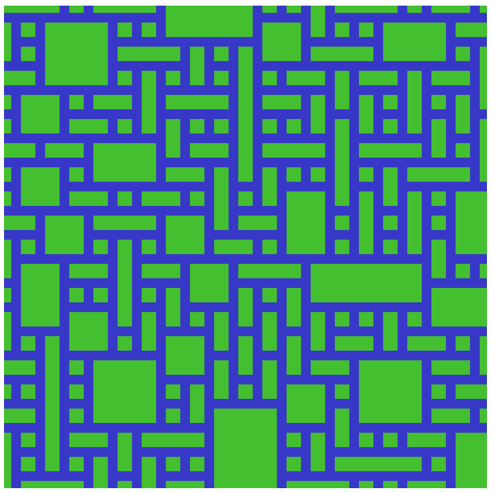
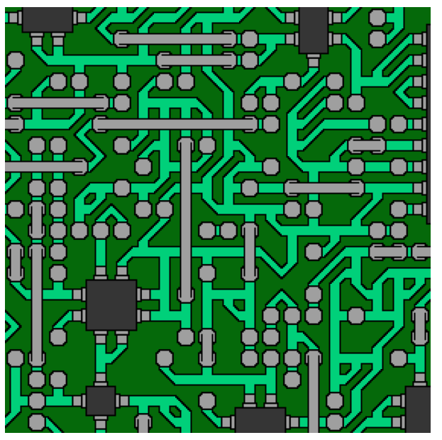
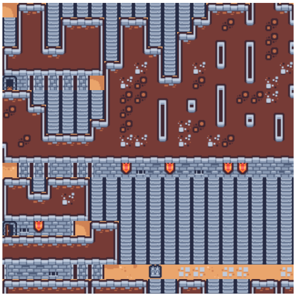

# Wave Function Collapse
Tilemap generation using [p5.js framework](https://p5js.org/es/) based on:

* [Maxim Gumin Repositry](https://github.com/mxgmn/WaveFunctionCollapse)
* [CodingTrain Repository](https://github.com/CodingTrain/Wave-Function-Collapse)

# Examples
## Pipe

## Ciruit

## Tiny Dungeon (Goes wrong)
Tileset from Kenney free assets: [Tiny Dungeon](https://kenney.nl/assets/tiny-dungeon)

